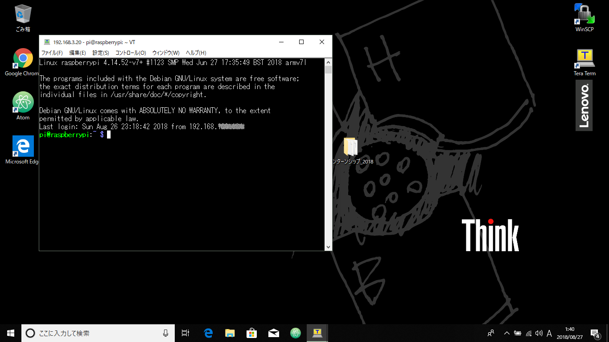

=====================
ドローンチーム
=====================

| データベースが更新され、更新された内容によってドローンを操作するところまでを解説します。

| 今回は以下の説明は省略します。

* RaspberryPiにNode.jsのインストール（rasbian v9.4）
* WindowsPCへのNode.jsのインストール（8.11.3）
* WindowsPCへのnpmのインストール（5.6.0）

RaspberryPiのIPアドレスを調べる
====================================
| RaspberryPiに以下を繋ぎます。

* キーボード（USB）
* マウス（USB）
* ディスプレイ（HDMD）
* 電源ケーブル

| ※電源ケーブルを繋ぐとRaspberryPiが起動します。（電源スイッチはありません。）

| OSが起動したら、ブラウザを開いてインターネットに接続されていることを確認します。

| インターネットに接続されていることが確認できたら、以下のコマンドを入力しIPアドレスを調べます。

::

  $ ifconfig

| ※IPアドレスはWindowsのPCからRaspberryPiを遠隔操作する際に必要となる情報のため、メモしておいてください。

RaspberryPiにアクセス（SSH）
====================================
| WindowsのPCからRaspberryPiを遠隔操作するために、SSH接続を行います。

| Windows PCのデスクトップから「Tera Term」を起動します。

| 先ほどメモしておいたRaspberryPiの「IPアドレス」を入力
| 「TCPポート」には"22"を入力し、
| 「OK」を押下

.. image:: ../img/TeraTerm1.png
   :scale: 100%
   :height: 400px
   :width: 800px
   :align: left

| パスワード入力(講師が入力します)
| 接続完了

RaspberryPi上に作業ディレクトリの作成
==============================================
| mkdirコマンドでディレクトリを作成して、cdコマンドでその中に移動します。

::

    $ mkdir drone
    $ cd drone

各種モジュールのインストール
====================================

::

  $ npm init

| 全て「Enter」

| rolling-spiderモジュールインストール

::

  $ npm install rolling-spider --save

| superagentモジュールインストール

::

  $ npm install superagent --save

| Firebaseモジュールインストール

::

  $ npm install firebase --save

Node.jsプログラムを書いてみよう
=============================================
データベースを監視し、ドローンに命令を送るプログラムを記述します。

drone.jsの作成
--------------------------------
| ※「動き」を増やす場合は、このファイルに「動き」を追加します。
| WindowsのPCで以下のコードをテキストエディタで入力し、「drone.js」として保存

.. code-block:: none

  // モジュール読み込み
  const Drone = require("rolling-spider");
  const drone = new Drone();
  var request = require('superagent');
  var firebase = require("firebase");

  // 各種変数
  drone.isActive = false;                        // ドローンがアクティブか否か

  // ドローンの初期設定
  drone.connect( () => {                         // BLE でドローンに接続し、接続できたらコールバック
  drone.setup( () => {                           // ドローンを初期設定してサービスや特徴を取得、その後コールバック
   drone.flatTrim();                             // トリムをリセット
   drone.startPing();                            // 継続的に接続させる
   drone.flatTrim();                             // トリムをリセット
   drone.isActive = true;                        // ドローンをアクティブ状態にする
   console.log(drone.name + " is ready.");       // 準備OKなことをコンソール出力
  });
  });

  // Initialize Firebase
  var config = {
   apiKey: "xxxxxxxxxxxxxxxxxxxxxxxxxxxxxxxx",
   authDomain: "xxxxxxxxxxxxxxxxxxxxxxxxxxxxxxxx",
   databaseURL: "xxxxxxxxxxxxxxxxxxxxxxxxxxxxxxxx",
   projectId: "xxxxxxxxxxxxxxxxxxxxxxxxxxxxxxxx",
   storageBucket: "xxxxxxxxxxxxxxxxxxxxxxxxxxxxxxxx",
   messagingSenderId: "xxxxxxxxxxxxxxxxxxxxxxxxxxxxxxxx"
  };
  firebase.initializeApp(config);

  //database更新時
  var db = firebase.database();
  db.ref("/drone").on("value", function(changedSnapshot) {
  //値取得
  var value = changedSnapshot.child("message").val();
  console.log(value);

  if (value) {

   if (value == 'fly') {
     console.log('離陸');
     drone.takeOff();

   } else if (value == 'forward') {
     console.log('前進');
     drone.forward( {steps: 10});

   } else if (value == 'down') {
     console.log('着陸');
     drone.land();

   } else if (value == 'up') {
     console.log('上昇');
     drone.up( {steps: 10});

   }

   //Realtime Database に空白を入れる
   db.ref("/drone").set({"message": ""});

  }
  });

drone.jsの修正（Firebaseの承認を追加）
-----------------------------------------------
| ※Google Homeチームがデータベースの作成が完了していることが前提となります

| Firebaseにログイン（Google Homeチームが使っているアカウントで）

| 左メニューの「Project Overview」の右横の「歯車マーク」を選択
| 「プロジェクトの設定」を押下

| 「アプリ」の"ウェブアプリにFirebaseを追加"を押下

| ウェブアプリにFirebaseを追加の//　Initialize Firebase　から　</script>の前までをコピー

.. image:: /img/Firebase_Auth.png
   :scale: 100%
   :height: 400px
   :width: 800px
   :align: left

| テキストエディタで「deone.js」を開き
| //　Initialize Firebaseの部分を先ほどコピーした内容に書き換え、
| 上書き保存。

drone.jsをRaspberryPiへ転送
--------------------------------
| WindowsのPC上で作成した「drone.js」をRaspberryPi上で実行させるために、
| 「drone.js」ファイルをWindowsのPC　→　RaspberryPiへ転送します。

| Windows PCのデスクトップから「WinSCP」を起動します。

.. image:: /img/winScp1.png
   :scale: 100%
   :height: 400px
   :width: 800px
   :align: left

| 「ホスト名」にRaspberryPiのIPアドレスを入力。
| 「ポート番号」に"22"を入力。
| 「ユーザー名」「パスワード」を入力。（講師が入力します。）
| 「ログイン」を押下

| 先ほど作成した「drone.js」をWindowsのPCからRaspberryPiの「droneディレクトリ」（作業ディレクトリ）にドラッグアンドドロップで転送。

Node.jsプログラムを実行
=============================================
| DB上のデータが更新された際に、ドローンに命令を送るためのプログラムをRaspberryPi上で実行させます。

drone.jsを実行
--------------------------------
| cdコマンドで「drone.js」のあるディレクトリまで移動し、nodeコマンドでnodeを実行します。
| $ sudo node drone.js

drone.jsを停止
--------------------------------
| 実行中のnodeを停止する場合は「Ctrl + C」を押下します。

手動でDBを更新して、ドローンを飛ばしてみよう
=============================================

ドローンの電源を入れる
--------------------------------
| ドローンの裏側にあるスイッチを長押し、
| ライトが「緑色」に点滅したら準備完了

drone.jsを実行
--------------------------------
| 再度、以下のコマンドを入力しnodeを実行させる
| $ sudo node drone.js

手動でデータベースを更新する
--------------------------------
| DBが更新された際にドローンが動作するかを確認するために、手動でDBのデータを更新してみます。

| Firebaseにログインする
| 左メニューから「Database」を選択

| Databaaseで「Realtime database」を選択
| 「message」の中身を一旦""(空)にする。
| 「Enter」押下

.. image:: /img/realtimeDatabase1.png
   :scale: 100%
   :height: 400px
   :width: 800px
   :align: left

| 「message」の中身"fly"に書き換える。
| 「Enter」を押下し、データ更新。

| ドローンが「離陸」したら成功。
