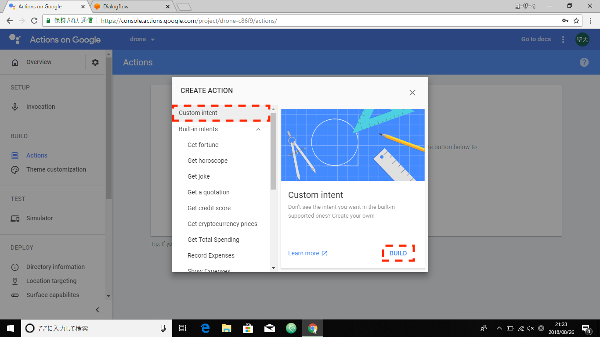
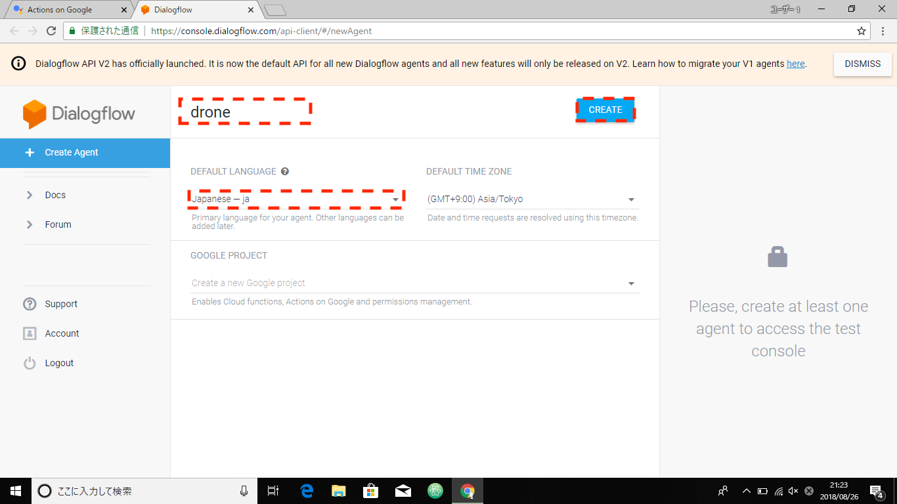
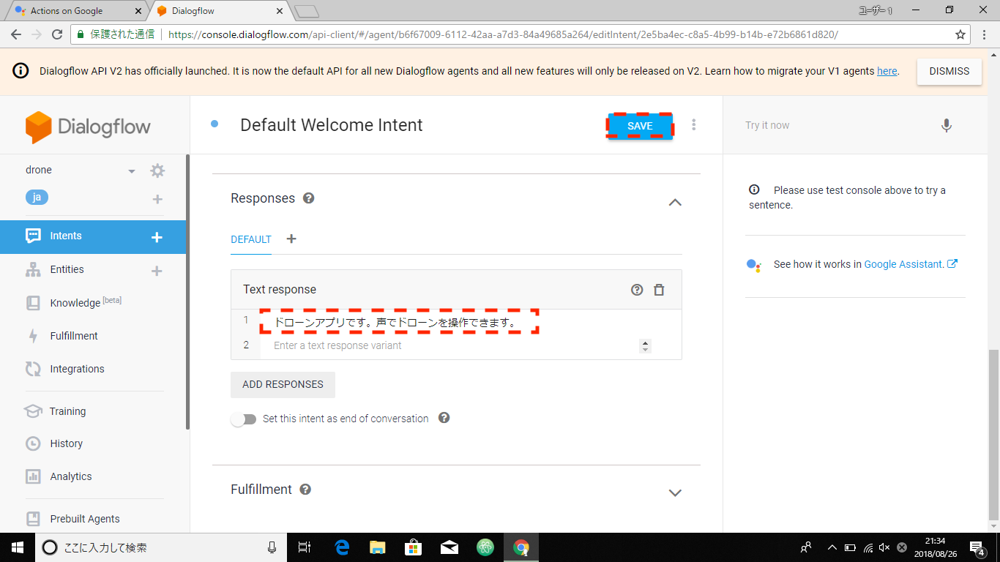
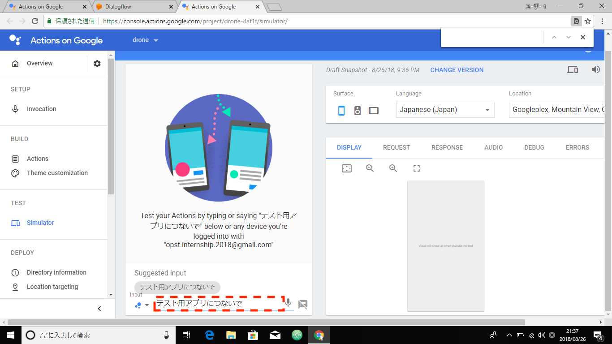
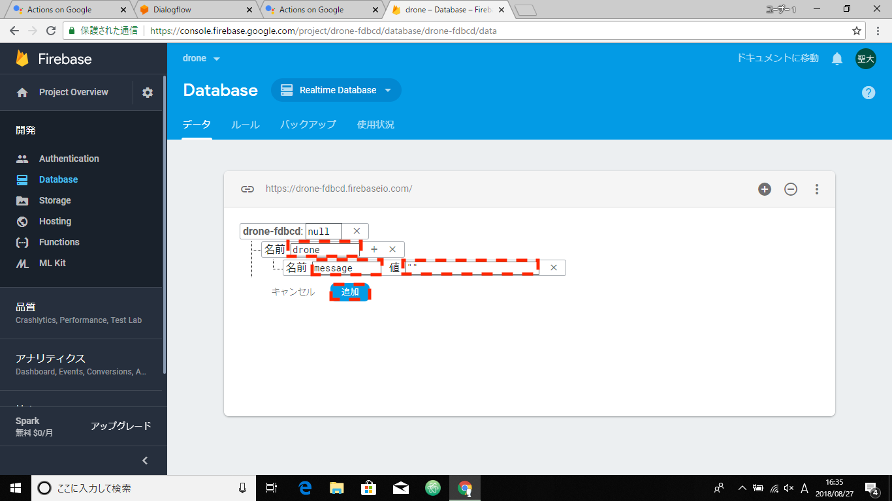
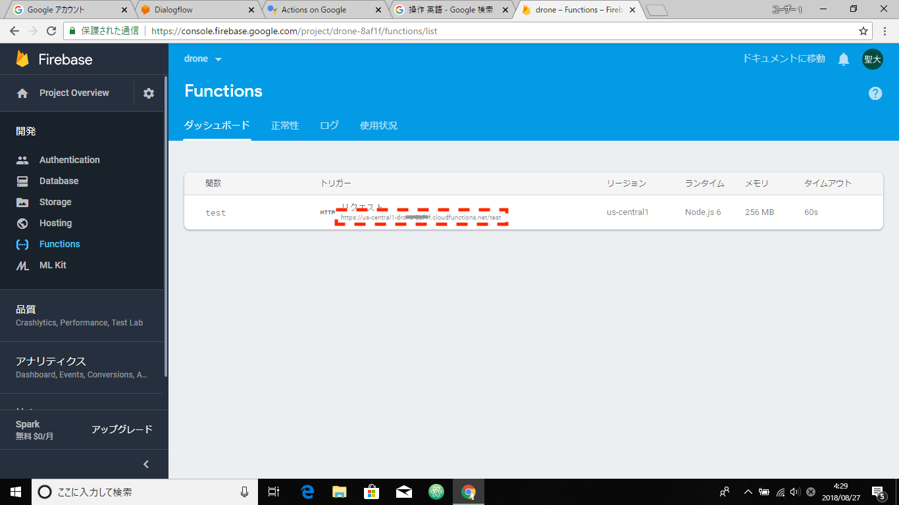
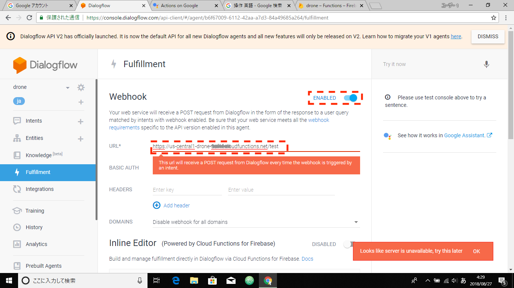

================================
GoogleHomeチーム
================================
| GoogleHomeに話しかけてデータベースを更新するところまでを解説します。

| 今回は以下の説明は省略します。

* GoogleHomeの設定
* Node.jsのインストール(v10.15.1)
* npmのインストール(v6.4.1)
* firebase-toolsのインストール

Google Homeアプリの作成
================================================
| Google Homeに話しかけた際に起動するアプリを作成します。

Action on Googleにログイン
--------------------------------
| Webブラウザ（Google Chrome）を起動します
| https://developers.google.com/actions/ にアクセスします。

| Googleアカウントでログインします。

.. note::

   - アカウント：opst.internship.2019@gmail.com
   - パスワード：講師が入力します

| 画面右上の「GO TO ACTIONS CONSOLE」を押下

プロジェクトの作成
--------------------------------
| 「New Project」を押下
| Project Nameに"drone"と入力、「language」は"Japanese"を選択、「conuntry」は"Japan"を選択し「Create project」を押下

| Welcome画面では画面左上の「Actions Console」を押下

Actionを追加
--------------------------------
| 先ほど作成したプロジェクト「drone」を選択
| 「Develop」タブを選択
| 左のメニューから「Actions」を選択
| 「Add your first action」を押下

| CREATE ACTIOMでは「Custom intent」を選択し、
| 「BUILD」を押下

Dialogflowのプロジェクト(Agent)の作成
================================================
| Agent nameに"drone-agent"と入力
| DEFAULT LANGUAGEを"Japanese - ja"を選択
| 「CREATE」を押下

Google Homeアプリ起動時のWelcome Intentを設定
----------------------------------------------------------------
| 「Default Welcom Intent」を選択
| 「Text response」の"こんにちは！"を"ドローンアプリです。声でドローンを操作できます。"に書き換える
| 「SAVE」を押下

Google Homeアプリの起動確認（シュミレータ）
=======================================================
| Google Homeに話しかけた際にアプリが正常起動するかを確認します。
| ここではブラウザ上でシュミレータを使いGoogle Homeアプリの起動を行います。

| Dialogflowの左メニューから「Integrations」を選択
| 「Google Assistant」を押下
| 「TEST」を押下

| 「Auto-preview change」が"ON"になっていることを確認し、
| 「CONTINUE」を押下

| Simulatorの「Input」に"テスト用アプリにつないで"と入力し、Enter（キーボード）を押下

| "わかりました。テスト用アプリのテストバージョンです。ドローンアプリです。声でドローンを操作できます。"と応答があればOKです。
| ※ここで先ほどWelcome Intentの設定で書き換えた文言が出力されます。

Google Homeでの動作確認（実機）
================================================
| 次に、Google Home（実機）に話しかけ、アプリが正常起動するかを確認します。

| "OK、Google。テストアプリにつないで。"と話しかける。
| （上記がGoogle Homeアプリの起動の言葉です。）

| "わかりました。テスト用アプリのテストバージョンです。ドローンアプリです。声でドローンを操作できます。"と応答があればOKです。

| ”やめて。”と話しかけ、アプリを終了します。
| （上記がGoogle Homeアプリの終了の言葉です。）

Firebase上にデータベース（Realtime Database）を作成
===========================================================================
| Firebase上にRealtime Databaseを構築します。

Firebaaseにログイン
----------------------------------------
| https://firebase.google.com　にアクセスします。
| 画面右上の「コンソールへ移動」を押下

| Firebaseで「drone」プロジェクトを選択

データベースを作成
----------------------------------------

| Firebaseの左メニューから「Database」を選択
| 「データベースの作成」を押下
| 「Cloud Firestore セキュリティルール」では"テストモードで開始"を選択し、
| 「次へ」を押下
| 「完了」を押下

| 画面左上の「Database」は「Realtime Database」を選択
| nullの右にある「＋」を押下
| 「名前」に"drone"と入力し、さらにその右横の「＋」ボタン押下
| 「名前」に"message"と入力し、「値」に""を入力し、
| 「追加」を押下

| ※Google Homeにドローンの操作を話しかけた場合、ここの「message」の値に動きの名前"fly"などが入ります。

ルールの変更
----------------------------------------
| 「ルール」タブを選択します。
| 「read」「write」が"false"にっている場合は、"true"に書き換え、
| 「公開」押下

DialogflowでIntentsを追加
================================================
| ※「動き」を増やす場合は、Intentsを追加していきます。
| ※ここでは「離陸」の動きを表すIntentを作成します。

| Dialogflowを開く
| 左メニューの「Intents」を選択
| 画面右上の「CREATE INTENT」を押下

| 「Intent name」に"fly"と入力し

| 「Training phrases」を押下
| Training phrasesの「ADD TRAINING PHRASES」を押下

| 「Add user expression」に"ドローンを飛ばして"と入力
| ※ここが「動き」の指示を出す際の言葉となります。（複数の言葉を追加することもできます。）
| 例えば、”離陸して”とか"飛び立てドローン"など

| 「Action and parameters」を押下
| Action and parametersの「ADD PARAMETERS AND ACTION」を押下
| 「PARAMETER NAME」に"message"を入力
| 「VALUE」に"fly"を入力
| ※ここではDBを更新する際の値を定義しています。
| 例えば、"ドローンを飛ばして"とGoogle Homeに話しかけるとDBの「message」の中身が"fly"に更新されます。

| 「Response」を押下
| Responseの「ADD RESPONSE」を押下
| TextResponseに"ドローンを飛ばします。"を入力
| ※ここではGoogle Homeに話しかけた際の返答を定義しています。
| たとえば、"ドローンを飛ばして"とGoogle Homeに話しかけて時に"ドローンを飛ばします"と返答が返ってきます。

| 「Fulfillment」を押下
| Fulfillmentの「ENABLE FULFILLMENT」を押下
| 「Enable webhook call for this intent」を"ON"にし、「SAVE」を押下

Google Homeでの動作確認（実機）
================================================
| "OK、Google。テストアプリにつないで。"と話しかける。
| "わかりました。テスト用アプリのテストバージョンです。ドローンアプリです。声でドローンを操作できます。"と応答がある。

| 続けて"ドローンを飛ばして"と話しかける
| "ドローンを飛ばします。"と返って来ればOK。
| ※ここではまだ、DBの更新は行われない。

DBのデータを更新するプログラムを作成
================================================
| Google Homeに動きの指示が話しかけられた際に、DBを更新するプログラムを作成します。
| 例えば、"ドローンを飛ばして"と話しかけられた際に、DBの「message」の中身を"fly"に更新します。

| WindowsのPCで「コマンドプロンプト」を起動
| cdコマンドでデスクトップに移動する。

::

  $ cd Desktop

| 作業ディレクトリ作成し、そのディレクトリに移動

::

  $ mkdir drone
  $ cd drone

Firebase Functionの設定
------------------------------
| Google Homeに話しかけられた際にDBを更新するFunction（プログラム）というものを作成します。

| 下記コマンドで、Firebaseにログイン

::

  $ firebase login

| 下記コマンドでFirebaseプロジェクトの初期化

::

  $ firebase init

| ?Are you ready to proceed? (Y/n)　ここでは、「y」を押下した後「Enter」を押下

| (*) Functions: Configure and deploy Cloud Functions　を選択（選択は「↓」で行まで移動して、「スペースキー」を押下、「Enter」押下）

| 「drone」を選択し「Enter」押下

| 「JavaScript」を選択し「Enter」押下

| ?Do you want use ESLint to catch probable bugs and enforce style?は、「n」を押下した後「Enter」を押下

| ?Do you want to install dependencies with npm now?は、「y」を押下した後「Enter」を押下

DBを更新するFunction（プログラム）を記述
-----------------------------------------
WindosのPCで「index.js」をテキストエディタで以下の通りに書き換える

.. code-block:: js

  const functions = require("firebase-functions")
  const admin = require("firebase-admin")
  admin.initializeApp(functions.config().firebase)

  //WEB API処理
  exports.test = functions.https.onRequest((request, response) => {

  //ログ出力
  console.log('Request headers: ' + JSON.stringify(request.headers));
  console.log('Request body: ' + JSON.stringify(request.body));

  //Dialogflowからのパラメータ取得
  const message = request.body.queryResult.parameters.message
  const textResponse = request.body.queryResult.fulfillmentText

  console.log('message: ' + message);

  //Databaseへの書き込み情報
  const path = "/drone"
  const word = message

  //Dialogflowへ`speech`と`displayText`の情報を返す
  response.setHeader("Content-Type", "application/json")
  response.send(
  JSON.stringify({
   "fulfillmentText": textResponse
  })
  );

  //Databaseを更新
  admin.database().ref(path).set({message: word})
  });

作成したFunctionをFirebaseにデプロイ
------------------------------------------------------------
| 以下のコマンドでFunctionをFirebaseにデプロイする

::

  $ firebase deploy

Dialogflowの設定を変更
------------------------------------------------------------
| Firebaseの左メニューから、「Functions」を選択
| トリガーのHTTPリクエスト（URL）をコピーする

| Dialogflowを開き、左メニューから「Fulfillment」を選択
| 「Webhook」を「ENABLED」に変更
| 「URL」に先ほどコピーした「トリガーのHTTPリクエスト（URL）」を貼り付け、
| 「SAVE」を押下

データベース更新チェック
------------------------------------------------------------
| 「Action on google」を開き、左メニューから「Simulator」を選択
| Simulatorの「Input」に"OK、Google。テスト用アプリにつないで"と入力し「Enter」押下
| "はい。テスト用アプリのテストバージョンです。ドローンアプリです。声でドローンを操作できます。"と応答が返ってきたら、
| 引き続き「Input」に"ドローンを飛ばして"を入力し「Enter」押下

Firebaseのログを確認
------------------------------------------------------------
| 正常に動作したかを確認するために"ログ"を確認します。

| Firebaseを開き、左メニューの「Functions」を選択
| 「ログ」タブを選択
| ログが表示され"Function execution took 7 ms, finished with status code: 200"が表示されていれば正常に動作しています。

| Google Homeチームの作業はここまでです。
| 「動き」を増やすす場合は、「Dialogflow」で「Intents」を増やしてみてください。
